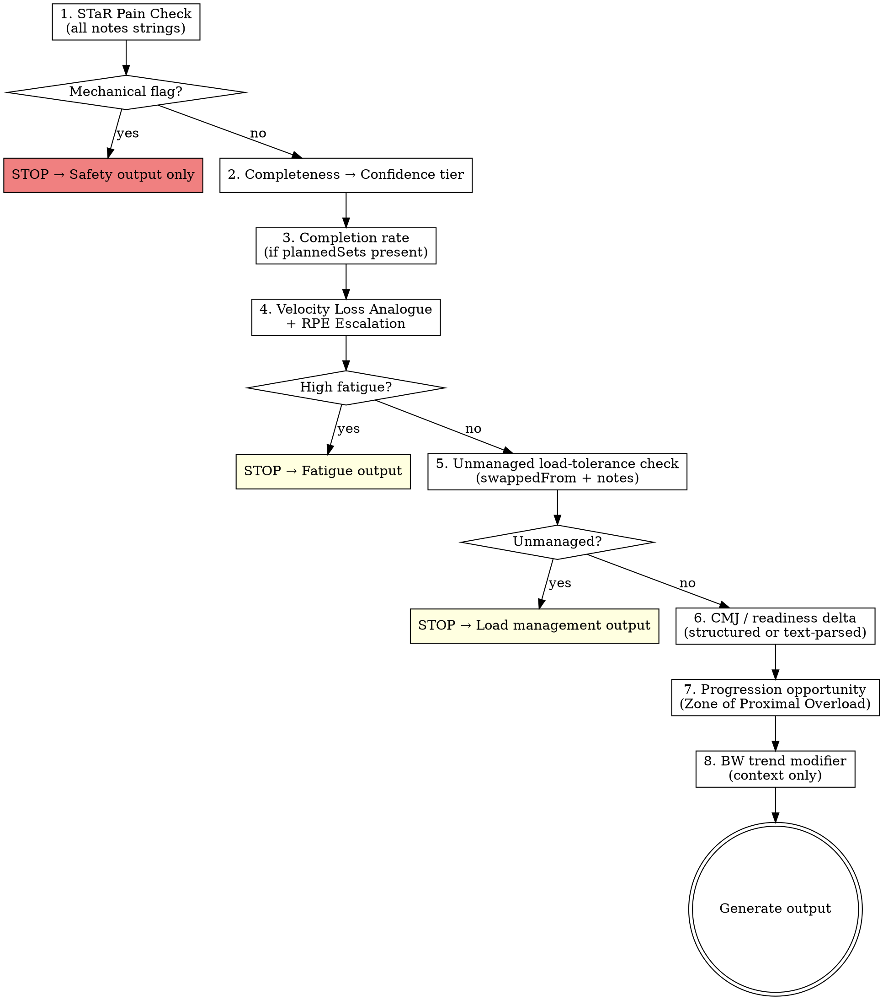

# GymTrack Session Feedback

Analyse a completed workout and produce concise, evidence-based coaching feedback. One takeaway. No overcoaching.

**Scope:** Single-session analysis. Does not create programs, modify periodization, or diagnose injuries. See companion skills for weekly planning and program creation.

---

## Setup

**Before analysing:** Read `../shared/schema-reference.md` and `../shared/science-reference.md`. These contain the field definitions, confidence tiers, derived metric formulas, STaR framework, VLA thresholds, and external focus rule that this skill depends on.

---

## Invocation

The user provides data in one of three ways:

1. **Paste export JSON** — `type: "workout-log"` from the app's Claude tab, or raw JSON
2. **Share URL** — fetch `https://api.gymtrack.hithitpull.fi/data/{uuid}` and parse the backup as a `gymtrack-backup` (use `sessions` + `currentPlan` + `bodyWeight`)
3. **Plain text session** — any structured gym session text; apply graceful degradation (see `schema-reference.md`)

Identify the most recent session and analyse it against the session immediately before it (for trend signals).

---

## Processing Order

Run these steps in sequence. Stop at the first Priority 1 or 2 flag — do not continue to lower-priority analysis.



For detailed signal definitions and thresholds, see `science-reference.md`.
For field names and derived metric formulas, see `schema-reference.md`.

---

## Special Cases

**Partial session** (`completionRate < 60%`): Run STaR pain check first. If a pain or mechanical flag is found, it explains the cutoff — stop there. If no flag: check session notes for an explicit reason. If ambiguous: reflect partial execution in output and flag Low confidence. Do not guess the cause.

**Generic / non-app data**: Accept any structured gym session text. Confidence is Low unless RPE is present (Medium) or RPE + notes + comparison session are present (High). See `examples.md` for a worked generic-data example.

---

## Output Format

```
SESSION RESULT: [One sentence — execution against intent]

KEY POSITIVE: [Single highest-ranking positive signal]

KEY LIMITER: [Single highest-ranking limiting signal — or "None detected" if none]

NEXT ACTION: [One actionable recommendation, external focus language only]

CONFIDENCE: High / Medium / Low
```

**Length:** 50–100 words. Absolute maximum: 120 words.

**External focus rule (mandatory):** All NEXT ACTION language must target the implement or environment — never internal anatomy. "Push the floor away" not "contract your quads." See `science-reference.md §C` for the full constraint and examples.

**Do not:**
- Surface more than one positive and one limiter
- Diagnose structural injuries ("you have tendinitis")
- Create programs or prescribe future sessions
- Invent metrics that are not in the data
- Output anything beyond the five-field structure above

---

## Reference Files

| File | Contents |
|------|----------|
| `../shared/science-reference.md` | STaR framework, VLA formula + thresholds, external focus rule, BW modifier, citations |
| `../shared/schema-reference.md` | GymTrack JSON field definitions, confidence tiers, derived metric formulas, generic data guidance |
| `examples.md` | Three worked examples: power session (High confidence), mechanical pain cutoff, generic text input |
